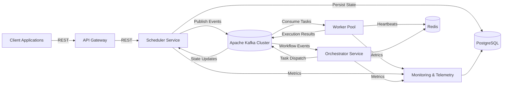

# PipeX

> **Distributed Event-Driven Workflow Orchestration Platform**
>
> PipeX is a high-throughput, fault-tolerant, microservices-based workflow execution platform designed for large-scale asynchronous job processing, dynamic scheduling, and distributed task orchestration.

---

# Overview

PipeX is a distributed workflow and job processing platform engineered to execute computational workloads across a horizontally scalable cluster of worker nodes.

The platform is designed around an event-driven architecture where independent services communicate through durable event streams, enabling resilient execution, elastic scalability, and operational observability.

Unlike traditional monolithic schedulers that become bottlenecks under high concurrency, PipeX separates scheduling, orchestration, execution, telemetry, and API concerns into independently deployable services connected through Apache Kafka.

The result is a platform capable of supporting:

* High-volume asynchronous job execution
* Long-running computational workflows
* Resource-aware workload placement
* Multi-tenant task orchestration
* Distributed fault recovery
* Backpressure-aware scheduling
* Horizontal cluster scaling
* Deterministic workflow state management

---

# Value Proposition

## High Throughput

Kafka-backed event streams allow millions of workflow events to be processed independently without introducing centralized execution bottlenecks.

## Fault Tolerance

Job state transitions are persisted using ACID-compliant transactions, enabling recovery from service crashes, node failures, and transient infrastructure disruptions.

## Elastic Scalability

Worker nodes can be added or removed dynamically while the orchestration layer continuously rebalances workload distribution.

## Resource Awareness

Scheduling decisions are made using real-time cluster telemetry, allowing CPU, memory, and queue pressure metrics to influence execution placement.

## Operational Visibility

Comprehensive telemetry pipelines provide visibility into:

* Workflow execution progress
* Consumer lag
* Worker health
* Cluster saturation
* Scheduling efficiency
* Failure rates

---

# Architecture

## High-Level System Design



---

# Service Architecture

## API Gateway

### Responsibilities

* Authentication and authorization
* Request validation
* Tenant isolation
* Rate limiting
* Request routing
* API version management
* Workflow submission endpoint exposure

### Communication

| Direction           | Protocol |
| ------------------- | -------- |
| Client → Gateway    | REST     |
| Gateway → Scheduler | REST     |

### Technology Stack

* Java
* Spring Boot
* Spring Security
* JWT Authentication
* Resilience4j

---

## Scheduler Service

### Responsibilities

* Workflow lifecycle management
* State transition validation
* Scheduling policy evaluation
* Queue prioritization
* Persistence of execution metadata
* Retry orchestration

### Communication

| Direction              | Protocol     |
| ---------------------- | ------------ |
| Gateway → Scheduler    | REST         |
| Scheduler → Kafka      | Event Stream |
| Scheduler → PostgreSQL | SQL          |

### Technology Stack

* Java
* Spring Boot
* Spring Data JPA
* PostgreSQL
* Kafka Producer

---

## Orchestrator Service

### Responsibilities

* Cluster topology awareness
* Worker pool balancing
* Capacity planning
* Resource allocation
* Execution placement decisions
* Distributed coordination

### Communication

| Direction            | Protocol                 |
| -------------------- | ------------------------ |
| Kafka ↔ Orchestrator | Event Stream             |
| Redis ↔ Orchestrator | Distributed Coordination |

### Technology Stack

* Java
* Spring Boot
* Kafka Consumer Groups
* Redis
* Distributed Scheduling Engine

---

## Worker Pool

### Responsibilities

* Stateless task execution
* Workflow step processing
* Result publishing
* Heartbeat broadcasting
* Runtime telemetry reporting

### Communication

| Direction               | Protocol       |
| ----------------------- | -------------- |
| Kafka ↔ Workers         | Event Stream   |
| Redis → Heartbeat Store | Redis          |
| Telemetry Service       | Metrics Stream |

### Technology Stack

* Java
* Spring Boot
* Docker
* Kafka Consumer API

---

## Event Bus

### Responsibilities

* Durable event streaming
* Workflow event persistence
* Replay support
* Ordered partition processing
* Horizontal throughput scaling

### Communication

| Direction    | Protocol            |
| ------------ | ------------------- |
| All Services | Kafka Event Streams |

### Technology Stack

* Apache Kafka
* Kafka Consumer Groups
* Kafka Topics
* Log Compaction

---

## Monitoring & Telemetry Service

### Responsibilities

* Heartbeat aggregation
* Consumer lag monitoring
* Failure analysis
* Performance dashboards
* Cluster health reporting
* Execution metrics collection

### Communication

| Direction            | Protocol       |
| -------------------- | -------------- |
| Services → Telemetry | Metrics Stream |
| Telemetry → Database | SQL            |

### Technology Stack

* Spring Boot
* Kafka Consumers
* PostgreSQL
* Prometheus Integration
* Grafana Dashboards

---

# Advanced Engineering Architecture

---

# Hybrid Scheduling Engine

PipeX implements a multi-layer scheduling architecture designed to maximize cluster utilization while preventing resource starvation and execution bottlenecks.

Rather than relying on a simple FIFO queue, scheduling decisions are derived from three independent scheduling dimensions.

---

## Layer 1: Priority-Based Queueing

Incoming jobs are assigned priority classes.

```text
CRITICAL
HIGH
NORMAL
LOW
```

Priority classes are mapped onto dedicated Kafka partitions and scheduling queues.

This provides:

* Predictable execution ordering
* Priority isolation
* Reduced head-of-line blocking
* Improved SLA guarantees

Scheduling complexity remains effectively distributed because Kafka partitions naturally parallelize consumption.

---

## Layer 2: Resource-Aware Allocation

Worker nodes continuously publish telemetry snapshots containing:

```json
{
  "workerId": "worker-17",
  "cpuUsage": 42.3,
  "memoryUsage": 61.8,
  "activeTasks": 7,
  "availableCapacity": 13
}
```

The Orchestrator continuously evaluates cluster capacity before assigning new workloads.

Allocation decisions consider:

* CPU utilization
* Memory pressure
* Queue depth
* Active execution count
* Historical throughput

This prevents:

* Node saturation
* Hotspot formation
* Uneven workload distribution

---

## Layer 3: Adaptive Load Balancing

PipeX incorporates a backpressure-aware scheduling mechanism.

The Scheduler continuously evaluates:

```text
Database Connection Pool Saturation
Kafka Consumer Lag
Execution Queue Growth
Worker Availability
```

When infrastructure pressure exceeds configured thresholds, ingestion rates are dynamically throttled.

Mathematically:

```text
Effective Throughput

T = min(
Kafka Capacity,
Worker Capacity,
Database Capacity
)
```

This ensures scheduling never exceeds downstream system capabilities.

---

# Distributed Fault Tolerance Matrix

Fault tolerance is a first-class architectural concern within PipeX.

Every workflow execution follows a deterministic state machine.

---

## Workflow State Machine

```text
PENDING
   |
   v
RUNNING
   |
   +------------+
   |            |
   v            v
COMPLETED    FAILED
```

State transitions are persisted within PostgreSQL using transactional guarantees.

A workflow can never transition directly from:

```text
PENDING -> COMPLETED
```

or

```text
FAILED -> RUNNING
```

without explicit recovery logic.

This eliminates inconsistent execution states.

---

## ACID-Safe State Persistence

Each transition executes within a single database transaction.

Example:

```sql
BEGIN;

UPDATE jobs
SET status = 'RUNNING'
WHERE id = :jobId;

INSERT INTO execution_events(...);

COMMIT;
```

This guarantees:

* Atomicity
* Consistency
* Isolation
* Durability

even during infrastructure failures.

---

## Heartbeat Lease Management

Each worker maintains a renewable execution lease.

Example heartbeat:

```json
{
  "workerId": "worker-17",
  "timestamp": "2026-05-01T15:31:10Z",
  "activeExecutions": 6
}
```

Redis stores heartbeat records using TTL expiration.

```text
worker:17
TTL = 30 seconds
```

If lease renewal stops:

```text
TTL Expired
     ↓
Worker Marked Offline
     ↓
Tasks Reassigned
```

This enables automatic recovery from:

* Node crashes
* Network partitions
* Container failures
* Infrastructure outages

---

## At-Least-Once Delivery Guarantees

PipeX intentionally adopts an At-Least-Once processing model.

Benefits include:

* No silent data loss
* Durable workflow execution
* Reliable recovery semantics

Potential duplicate processing is mitigated through idempotent execution design.

---

## Exponential Backoff Retries

Transient failures trigger automatic retries.

Retry schedule:

```text
Attempt 1 → 5 sec
Attempt 2 → 15 sec
Attempt 3 → 45 sec
Attempt 4 → 135 sec
Attempt 5 → DLQ
```

Formula:

```text
Delay = BaseDelay × 3^RetryCount
```

---

## Dead Letter Queues (DLQs)

Workloads that exceed retry limits are redirected into dedicated Dead Letter Queues.

DLQ metadata includes:

```json
{
  "jobId": "job-921",
  "failureReason": "Invalid payload schema",
  "retryCount": 5,
  "lastFailureTimestamp": "2026-05-01T15:42:10Z"
}
```

This prevents toxic payloads from repeatedly consuming cluster resources.

---

# Technical Stack & Architectural Trade-Offs

---

## Java + Spring Boot

### Why Not Go?

Go provides excellent concurrency primitives and lower memory overhead.

However, PipeX benefits heavily from:

* Mature enterprise ecosystem
* Rich dependency injection
* Advanced transaction management
* Spring Security
* Spring Data
* Production-grade observability tooling

### Why Not Node.js?

Node.js excels for I/O-heavy workloads but introduces challenges for highly concurrent orchestration systems requiring strong transactional guarantees and complex thread management.

### Decision

**Java + Spring Boot** delivers the strongest balance between reliability, maintainability, ecosystem maturity, and enterprise scalability.

---

## Apache Kafka

### Why Not RabbitMQ?

RabbitMQ is highly effective for traditional message queues.

However, PipeX requires:

* Event replay
* Historical reconstruction
* Log compaction
* Horizontal partition scaling
* High-throughput streaming

Kafka's append-only distributed log architecture aligns naturally with these requirements.

### Decision

**Apache Kafka** provides superior throughput, replayability, and large-scale event streaming capabilities.

---

## Redis

### Why Not In-Memory Maps?

Local process memory creates:

* Single-node dependency
* State inconsistency
* Failure recovery limitations

Redis provides:

* Distributed consistency
* Millisecond latency
* Native TTL support
* Atomic operations

### Decision

**Redis** is used for heartbeats, distributed coordination, and transient cluster state.

---

## PostgreSQL

### Why Not MongoDB?

Workflow execution requires:

* Strict relational constraints
* Transactional guarantees
* Referential integrity
* Deterministic state transitions

MongoDB excels at flexible document storage but introduces challenges for enforcing relational workflow invariants.

### Decision

**PostgreSQL** serves as the authoritative system of record for workflow metadata and state management.

---

## Docker

### Why Docker?

PipeX consists of multiple independently deployable services.

Docker provides:

* Environment parity
* Portable deployments
* Reproducible builds
* Infrastructure consistency
* Simplified local development

### Decision

**Docker** ensures deployment reliability across development, staging, and production environments.

---

# API Contract Specifications

---

# Submit Workflow

## Endpoint

```http
POST /api/v1/jobs
```

## Request

```json
{
  "name": "financial-risk-analysis",
  "tenantId": "tenant-001",
  "priority": "HIGH",
  "workflowDefinition": {
    "steps": [
      {
        "name": "extract-market-data",
        "type": "DATA_FETCH",
        "timeoutSeconds": 120
      },
      {
        "name": "calculate-risk-model",
        "type": "COMPUTE",
        "timeoutSeconds": 600
      },
      {
        "name": "generate-report",
        "type": "EXPORT",
        "timeoutSeconds": 180
      }
    ]
  },
  "executionPayload": {
    "portfolioId": "PF-98213",
    "analysisWindow": "90D",
    "currency": "USD"
  }
}
```

---

## Response

### 202 Accepted

```json
{
  "jobId": "job-9f8a2c41",
  "status": "PENDING",
  "submittedAt": "2026-05-01T15:30:12Z",
  "estimatedQueuePosition": 24,
  "trackingUrl": "/api/v1/jobs/job-9f8a2c41"
}
```

---

# Retrieve Job Status

## Endpoint

```http
GET /api/v1/jobs/{id}
```

---

## Response

### 200 OK

```json
{
  "jobId": "job-9f8a2c41",
  "name": "financial-risk-analysis",
  "tenantId": "tenant-001",
  "status": "RUNNING",
  "priority": "HIGH",
  "submittedAt": "2026-05-01T15:30:12Z",
  "startedAt": "2026-05-01T15:31:04Z",
  "progress": {
    "completedSteps": 2,
    "totalSteps": 3,
    "percentComplete": 66.67
  },
  "executionMetrics": {
    "runtimeSeconds": 437,
    "retryCount": 1,
    "workerExecutionCount": 2,
    "eventsProcessed": 1248
  },
  "nodeAffinity": {
    "currentWorker": "worker-17",
    "availabilityZone": "eu-central-1a",
    "clusterRegion": "eu-central-1"
  },
  "workflowSteps": [
    {
      "name": "extract-market-data",
      "status": "COMPLETED"
    },
    {
      "name": "calculate-risk-model",
      "status": "COMPLETED"
    },
    {
      "name": "generate-report",
      "status": "RUNNING"
    }
  ],
  "links": {
    "self": "/api/v1/jobs/job-9f8a2c41",
    "events": "/api/v1/jobs/job-9f8a2c41/events",
    "logs": "/api/v1/jobs/job-9f8a2c41/logs"
  }
}
```

---

# Non-Functional Characteristics

| Capability          | Design Goal                      |
| ------------------- | -------------------------------- |
| Availability        | 99.9%+                           |
| Message Delivery    | At-Least-Once                    |
| Consistency Model   | Strong State Consistency         |
| Scheduling Model    | Hybrid Priority + Resource Aware |
| Horizontal Scaling  | Linear Worker Expansion          |
| Fault Recovery      | Automatic                        |
| Event Persistence   | Durable Kafka Log                |
| Database Integrity  | ACID Transactions                |
| Heartbeat Detection | Redis Lease TTL                  |
| Deployment Model    | Containerized Microservices      |

---

# Repository Purpose

This public repository serves as the authoritative technical reference for PipeX.

Due to academic integrity requirements, licensing constraints, and intellectual property considerations, the production implementation is maintained in a private repository.

This repository contains:

* System architecture documentation
* Service interaction specifications
* Workflow lifecycle definitions
* API contracts
* Infrastructure topology diagrams
* Architectural decision records
* Engineering design documentation

The documentation contained herein represents the definitive blueprint of the PipeX platform and its distributed systems architecture.
